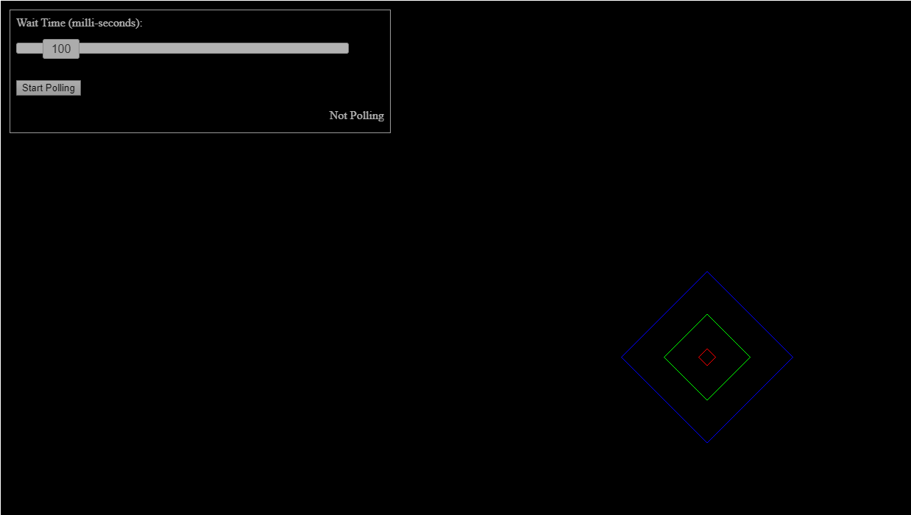

# Bullet Visualization
A web based interface to visualize and debug rigid bodies created using Bullet SDK.  
Contributions are welcome :smile:

# Building the project
## Server
- Integrate the following dependencies into your own C++ code:
  - [nlohmann::json](https://github.com/nlohmann/json)
  - [net11](https://github.com/malhotraprateek/net11) (Original [whizzter/net11](https://github.com/whizzter/net11))
  - [glm](https://github.com/g-truc/glm)
  - And [Bullet](https://github.com/bulletphysics/bullet3) (obviously).
- Clone this repository using the command: `git clone https://github.com/malhotraprateek/bullet-visualization.git`.
- Navigate to **bullet-server-code-reference** folder.
- Integrate files present in the folder into your own C++ application.  
  (See todo comments in code for more information)
- Make a test run by navigating to `http://localhost:4321/physicsdata` in your browser to check if the physics server is up.

**NOTE**: It is not a requirement to use the server reference files or create the server using C++, provided you follow the steps mentioned in the todo comments and have a good working knowledge of websocket communications.

## Client
- Clone this repository using the command: `git clone https://github.com/malhotraprateek/bullet-visualization.git`.
- Navigate to **bullet-visualization** folder.
- Run `npm install`.
- Run `npm run build`.
- Double click on **index.html** to open the visualizer in your default browser.
- Click on **Start Polling** button to start rendering debug data from Bullet.  
  Ensure the server is already up and running.

# Web View

# Internals

- Client-Server communication uses web sockets.
- [Three.js](https://github.com/mrdoob/three.js) is used to render to the browser (WebGL).
- Polling rate can be controlled by the slider provided.  
  This functionality has been given to avoid framerate drops and stuttering on the server.

# Disclaimers
- The visualizer can only handle debug lines for now.
- This project is not built for use in production environments.
- This project may not be feasible for applications with a very large number of rigid bodies as the debug information is transferred over network.  
  For most projects it should be fine though.
- The client and server has not been tested to run on separate machines.  
  Even so, there should not be anything inhibiting it.
